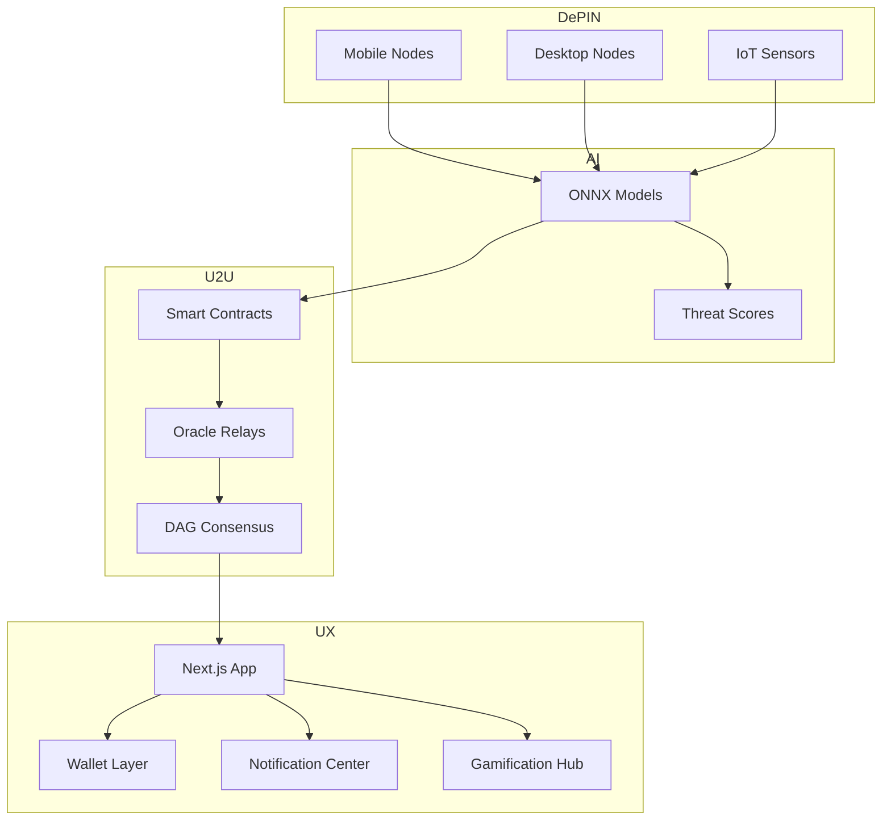

# DAGShield

[](LICENSE)
[](https://github.com/Aaditya1273/DAGShield/actions/workflows/dagshield-ci-cd.yml)
[](https://u2u.xyz)

> **AI security nodes. U2U DAG speed. U2U token rewards.**

## ⚡ Core Features

- **AI Detection:** <1s latency, multi-vector coverage, auto-tuned models
- **DAG Processing:** Parallel validation, energy-efficient, chain-agnostic relays
- **Privacy:** Zero-knowledge proofs, encrypted messaging, reputation scoring
- **Gamification:** U2U streaks, live leaderboards, weekly missions, NFT rewards
- **UX Boosters:** Wallet persistence, toast notifications, live analytics refresh

## 🚀 Quick Start

1. **Install:**
   ```bash
   git clone https://github.com/Aaditya1273/DAGShield.git
   cd DAGShield
   npm install
   ```
2. **Config:** copy `env.example` → `.env.local`, then fill in RPCs, wallet key, and chain ID (`39` for mainnet, `2484` for testnet).
3. **Run:**
   ```bash
   npm run dev
   # or
   npm run build && npm start
   ```

Need Rust node or contracts?
- `node-client/`: `cargo build --release` → `./target/release/dagshield-node start`
- `contracts/`: `npx hardhat compile && npx hardhat deploy --network u2uTestnet`

You’re live once `http://localhost:3000` loads and your wallet connects.

---

## ⭐ Super Highlights

- **World-class U2U Use Case:** DAGShield leans on U2U’s DAG consensus to keep security telemetry under one second, stream parallel threat verification, and broadcast rewards in native U2U tokens via `contracts/DAGShieldToken.sol`.
- **DePIN in Action:** Edge nodes (`node-client/`) transform phones, desktops, and IoT devices into “useful work” validators, earning streaks and payouts tracked in `components/gamification-dashboard.tsx` with SQLite persistence.
- **Real-time UX:** Notifications, analytics, and staking panels (`components/notification-bell.tsx`, `app/analytics/page.tsx`, `app/nodes/page.tsx`) mirror actual node activity, showcasing production-grade polish for judges.
- **Deployable Today:** Dockerized services, GitHub Actions CI (`.github/workflows/dagshield-ci-cd.yml`), and documented runbooks make DAGShield demo-ready in minutes.

---

## 🧭 System Architecture



---

## 🛠 Stack at a Glance
- **Frontend:** Next.js 15, Tailwind, shadcn/ui, Recharts, Wagmi/RainbowKit
- **Runtime:** Node.js 18, Edge-ready APIs under `app/api/`
- **Node Client:** Rust + libp2p + ethers-rs + RocksDB
- **AI:** PyTorch training → ONNX inference (`ai-models/`)
- **Contracts:** Solidity 0.8.24 with Hardhat deployment scripts
- **Persistence:** SQLite for gamification (`dagshield.db`), browser `localStorage` for quick UX state

---

## 🔁 Daily Workflows
- **Deploy contracts:** `npx hardhat deploy --network u2uTestnet`
- **Sync node client:** `cargo build --release && ./dagshield-node start`
- **Refresh analytics:** Nodes persist to `dagshield_nodes`; analytics page auto-polls every 30s.
- **Manage streaks:** `dagshield_user_streaks` keeps per-wallet activity history.
- **Send alerts:** `hooks/useNotifications.ts` generates toast + bell entries.

---

## 🧪 Test Checklist
```bash
npm run lint && npm run type-check
npm run test && npm run test:integration
npx hardhat test
cd node-client && cargo test
cd ai-models && python -m pytest
```

---

## 📦 Repo Cheat Sheet
```text
app/                # Next.js routes and API handlers
components/         # UI blocks (notifications, gamification, etc.)
hooks/              # Shared React hooks (wallet, notifications)
node-client/        # Rust edge node
contracts/          # Solidity suite
ai-models/          # Training scripts + ONNX export
scripts/            # Deployment helpers
```

---

## 🛣 Roadmap (next up)
- **Multi-chain relays** for non-U2U DAG networks
- **Marketplace for DePIN capacity** swaps
- **Historical analytics** and retention dashboards
- **ZK attestations** for sensitive threat sharing

---

## 🧠 Why Judges Love It
- **Proven DePIN flywheel:** real users secure the network and earn on day one.
- **U2U-native experience:** from wallet connection to rewards, everything speaks U2U.
- **Scalable roadmap:** expansion plans cover multi-chain, analytics, and privacy upgrades.

---

## 🤝 Contribute
- **Fork & branch:** `git checkout -b feature/my-upgrade`
- **Follow standards:** ESLint/Prettier, `cargo fmt`, Solidity style guide, `black`
- **Prove it works:** run the full test checklist
- **Open PR:** include screenshots or terminal output

---

## 📄 License & Support
- **License:** [MIT](LICENSE)
- **Docs:** [docs.dagshield.io](https://docs.dagshield.io)
- **Discord:** [discord.gg/dagshield](https://discord.gg/dagshield)
- **Twitter/X:** [@DAGShieldIO](https://twitter.com/DAGShieldIO)
- **Email:** team@dagshield.io
- **U2U Faucet:** [faucet.u2u.xyz](https://faucet.u2u.xyz)

---

**Built with ❤️ by the DAGShield contributors for a safer Web3 ecosystem.**
